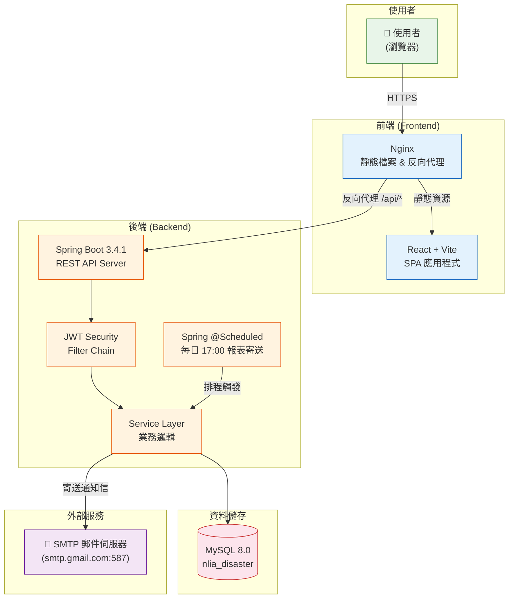
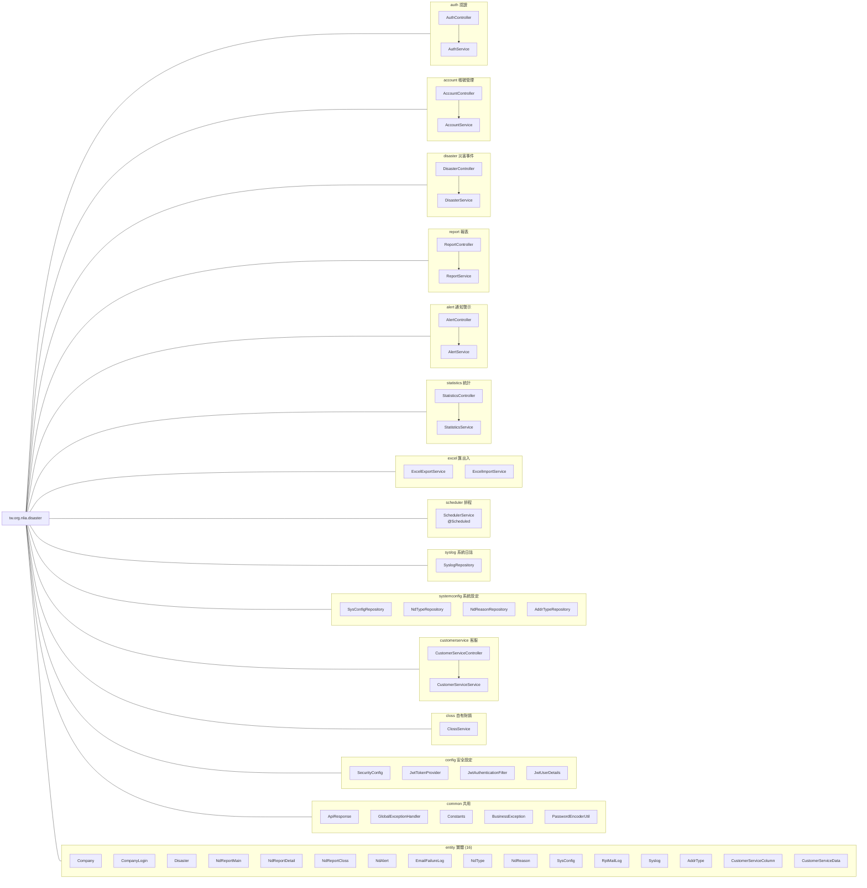
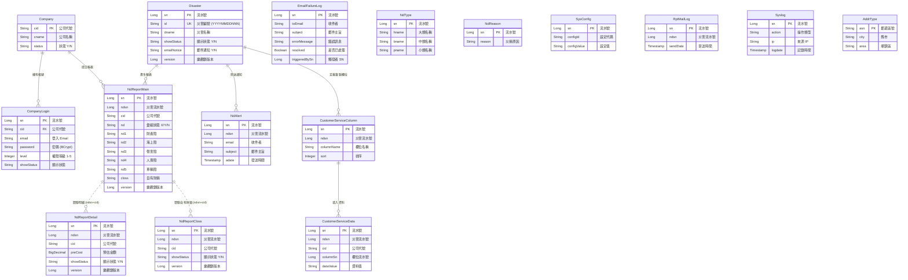
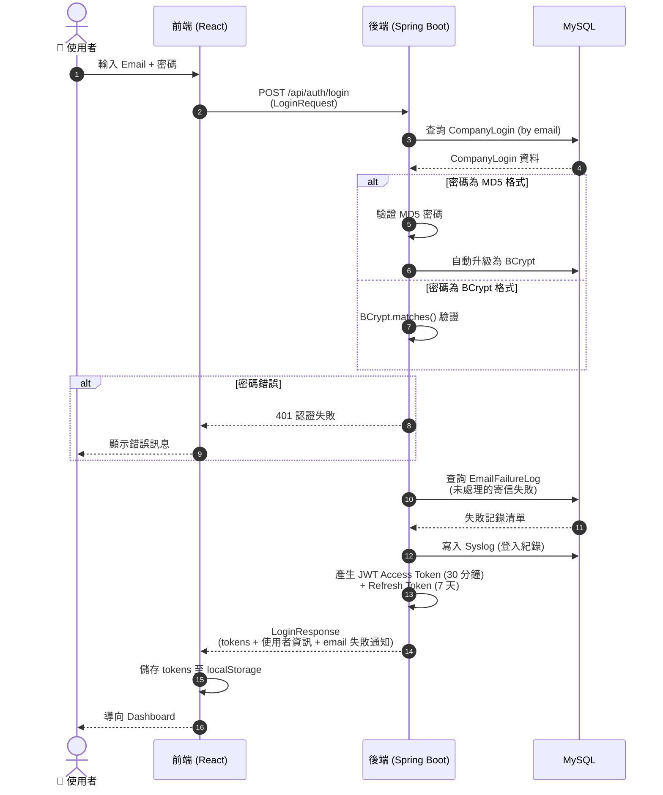
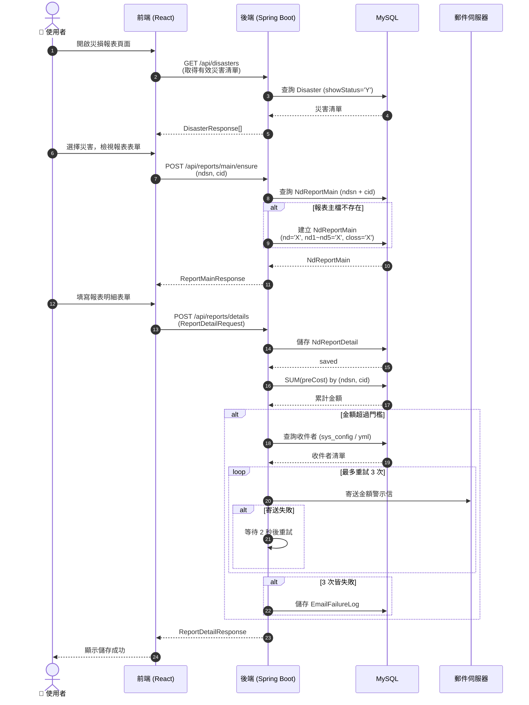
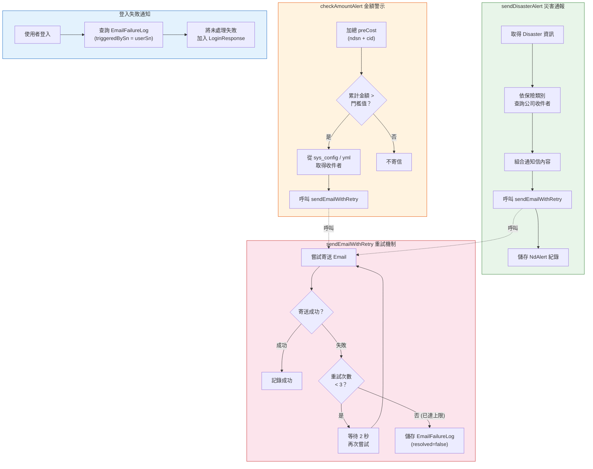
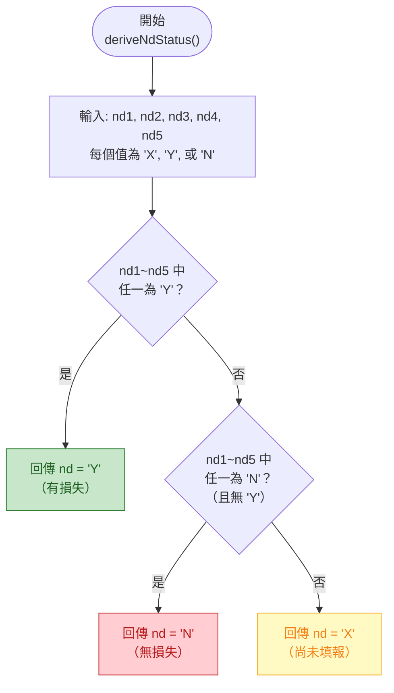
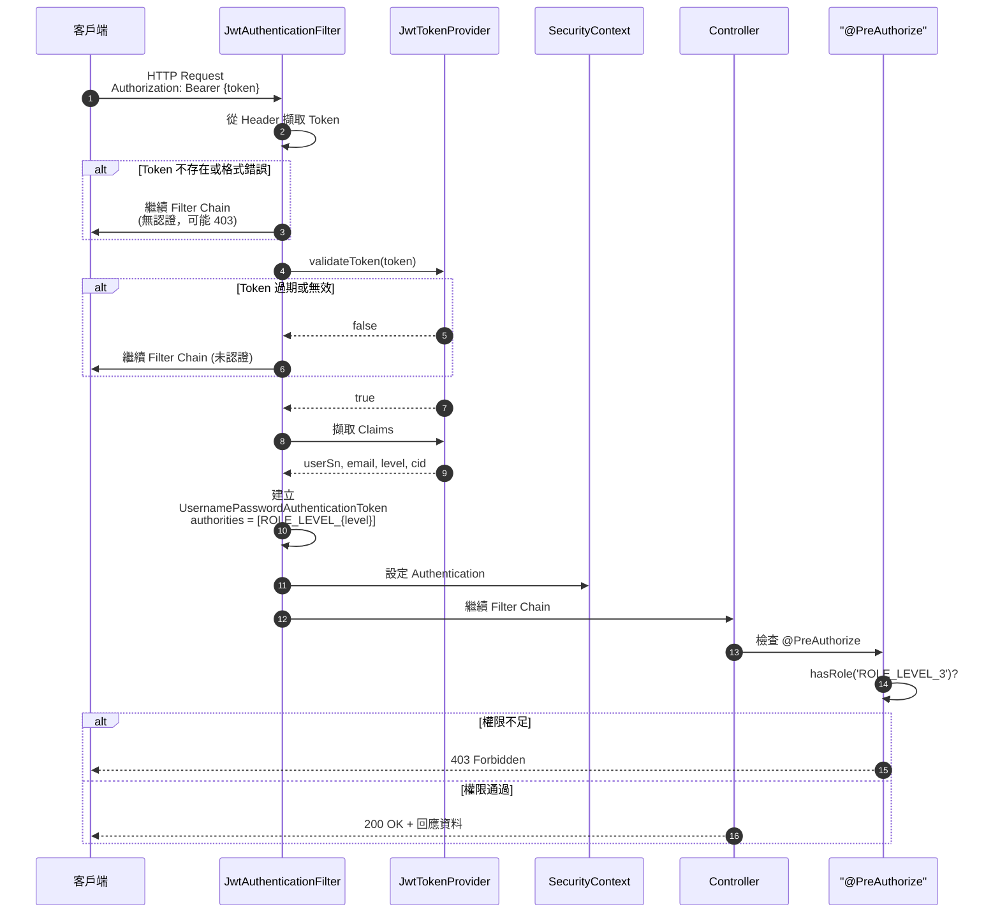
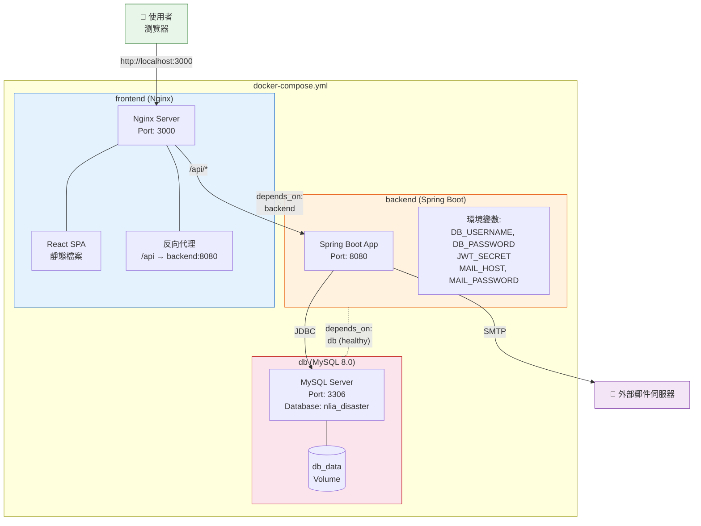
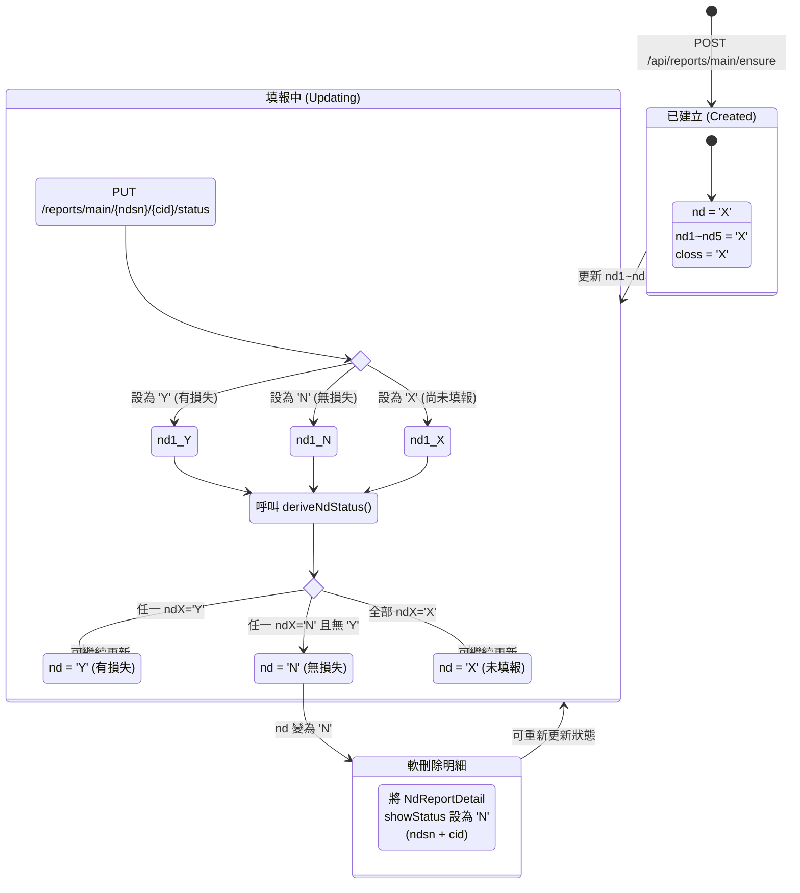

# 系統架構與流程圖 (Mermaid Diagrams)

> 本文件彙整所有 Mermaid 圖表，可在 GitHub / VS Code / 任何支援 Mermaid 的 Markdown 檢視器中直接渲染。

---

## 目錄

1. [系統架構圖 (System Architecture)](#1-系統架構圖-system-architecture)
2. [套件／模組結構圖 (Package Structure)](#2-套件模組結構圖-package-structure)
3. [ER 圖 (Entity Relationship)](#3-er-圖-entity-relationship)
4. [登入流程 (Login Sequence)](#4-登入流程-login-sequence)
5. [災損報表提交流程 (Report Submission Sequence)](#5-災損報表提交流程-report-submission-sequence)
6. [通知／警示流程 (Alert & Notification Flow)](#6-通知警示流程-alert--notification-flow)
7. [nd 狀態推導流程 (nd Status Derivation)](#7-nd-狀態推導流程-nd-status-derivation)
8. [JWT 認證流程 (JWT Authentication Flow)](#8-jwt-認證流程-jwt-authentication-flow)
9. [Docker 部署架構 (Docker Deployment)](#9-docker-部署架構-docker-deployment)
10. [報表主檔狀態機 (Report Main State Machine)](#10-報表主檔狀態機-report-main-state-machine)

---

## 1. 系統架構圖 (System Architecture)

以 C4 Model 風格呈現系統高層架構，涵蓋使用者、前端、後端、資料庫、郵件伺服器與排程器。

---

## 2. 套件／模組結構圖 (Package Structure)

後端 `tw.org.nlia.disaster` 套件結構，每個模組遵循 Controller → Service → Repository 分層。

---

## 3. ER 圖 (Entity Relationship)

涵蓋全部 16 個 JPA 實體及其關聯。帶有 `@Version` 標記的實體支援樂觀鎖。

> **說明**：虛線 (`..`) 表示 NdReportDetail / NdReportCloss 與 NdReportMain 之間透過 `(ndsn, cid)` 欄位關聯，但並非資料庫層級的外鍵約束。

---

## 4. 登入流程 (Login Sequence)

使用者登入系統的完整流程，包含密碼驗證、MD5 自動升級、Email 失敗通知等。

---

## 5. 災損報表提交流程 (Report Submission Sequence)

使用者提交災損報表的完整流程，包含自動建立報表主檔、金額警示等。

---

## 6. 通知／警示流程 (Alert & Notification Flow)

AlertService 的三大寄信情境及 EmailFailureLog 處理流程。

---

## 7. nd 狀態推導流程 (nd Status Derivation)

`NdReportMain.deriveNdStatus()` 方法的判斷邏輯，根據 nd1~nd5 五個欄位值推導出彙總狀態 `nd`。

---

## 8. JWT 認證流程 (JWT Authentication Flow)

每個 API 請求的 JWT 驗證與授權流程。

---

## 9. Docker 部署架構 (Docker Deployment)

`docker-compose.yml` 定義的服務拓撲與網路關係。

---

## 10. 報表主檔狀態機 (Report Main State Machine)

`NdReportMain` 的生命週期與狀態轉換。

---

> **附註**：所有圖表使用 [Mermaid](https://mermaid.js.org/) 語法，可在 GitHub、GitLab、VS Code (Markdown Preview Mermaid Support 擴充套件)、Notion 等平台直接渲染。
